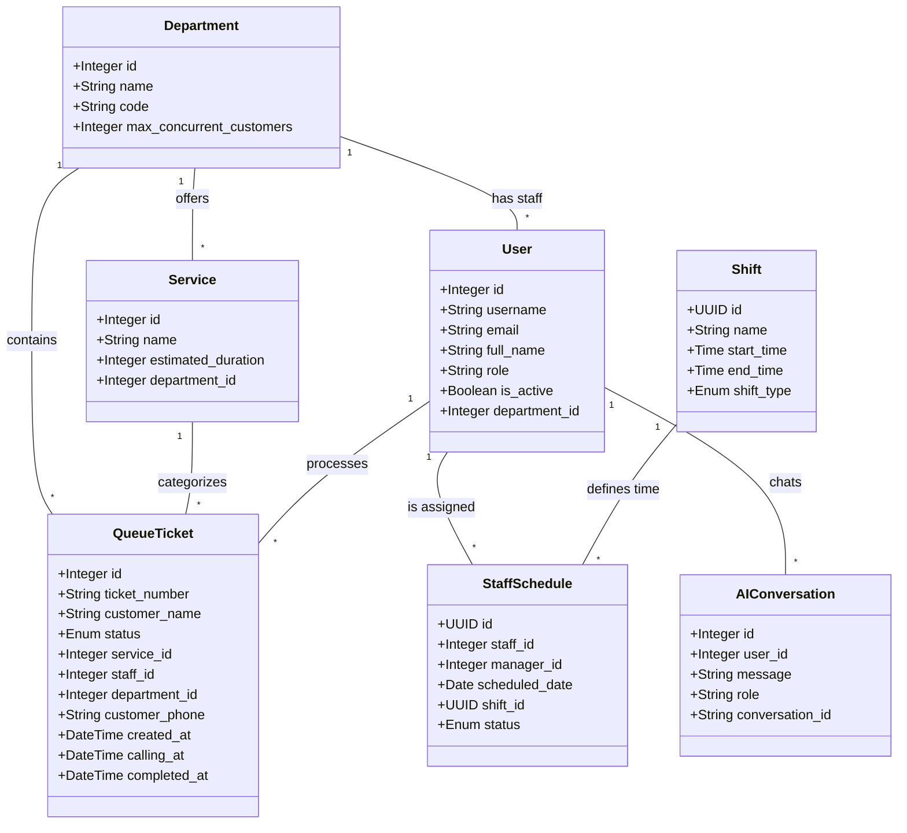

# Thiết kế UML Hệ thống Quản lý Hàng đợi (QMS)

Tài liệu này tổng hợp các biểu đồ UML Use Case và Class Diagram, đảm bảo phản ánh chính xác các tính năng hiện có trên giao diện (U.I) và cấu trúc dữ liệu Backend.

---

## 1. Sơ đồ Use Case (Use Case Diagram)

Sơ đồ này mô tả các chức năng người dùng tương tác trực tiếp trên giao diện hiện tại.

### 1.1. Sơ đồ Tổng quát (System Overview)

```mermaid
useCaseDiagram
    actor "Khách hàng" as c
    actor "Nhân viên" as s
    actor "Quản lý" as m
    actor "Quản trị viên" as a

    package "QMS - Chức năng thực tế trên UI" {
        usecase "Đăng ký STT (Kiosk/Mobile)" as UC1
        usecase "Theo dõi STT trên bảng hiện thị" as UC2
        usecase "Xử lý hàng đợi (Gọi/Hủy/Hoàn tất)" as UC3
        usecase "Quản lý lịch làm việc tuần" as UC4
        usecase "Tra cứu AI Helper (Chat Gemini)" as UC5
        usecase "Xem Dashboard thống kê" as UC6
        usecase "Gửi & Xử lý phản hồi" as UC7
        usecase "Quản trị hệ thống (Phòng ban/Dịch vụ)" as UC8
    }

    c --> UC1
    c --> UC2
    
    s --> UC3
    s --> UC5
    s --> UC6
    
    m --> UC4
    m --> UC6
    m --> UC7
    m --> UC5
    
    a --> UC8
```

### 1.2. Chi tiết theo Phân hệ (Sub-systems)

**Phân hệ Hàng đợi (Queue Operations)**
-   Khách hàng: Lấy số, Hủy số.
-   Nhân viên: Gọi số (Call), Bắt đầu (Process), Hoàn tất (Complete), Báo vắng (No Show).

**Phân hệ Lịch làm việc & AI (Staff Schedule & AI)**
-   Quản lý: Kéo thả nhân viên vào lưới lịch tuần, Lưu lịch.
-   Nhập liệu: Các câu hỏi cho AI (để tra cứu quy trình, thống kê).

---

## 2. Sơ đồ Lớp (Class Diagram)

Sơ đồ này mô tả chính xác các Model trong Database (PostgreSQL) và quan hệ của chúng trong mã nguồn backend.



### Ghi chú quan hệ:
-   **User - Department**: Một phòng ban có nhiều nhân viên.
-   **QueueTicket - Service**: Một phiếu thuộc về một dịch vụ.
-   **StaffSchedule - Shift**: Một bản ghi lịch sử dụng một ca làm việc (Sáng/Chiều/Tối).
